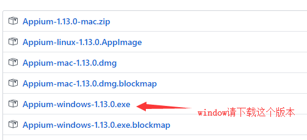
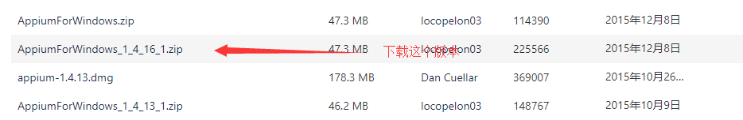
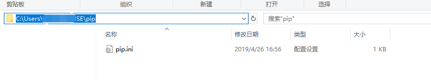

# appium 基础应用
 > 注意：appium是安卓app测试，请自行将安装环境配置好，这里不再另外说明安卓环境。
### 准备工作
   - 安装appium
     > 建议安装Appium-Desktop版本，Appium-server版本已经停止更新。
        - Appium-Desktop下载：[appium-desktop](https://github.com/appium/appium-desktop/releases)<br>
        
        - Appium-server下载：[appium-server](https://bitbucket.org/appium/appium.app/downloads/)<br>
        
        
   - 安装Appium-Python-Client<br>
       进入cmd,输入一下代码：
       ```pip install Appium-Python-Client```
       >如果遇到遇到下载缓慢的问题，可以将pip的下载源更换为国内的镜像网站，推荐使用清华大学的镜像站。
       更换方法为：在你的c盘下user（用户）文件夹里的用户名（自己取的名字）文件夹下新建一个pip文件，在pip文件夹下新建pip.ini文件并在文件中写入下面的内容：<br>
       \[global]<br>
        index-url = https://pypi.tuna.tsinghua.edu.cn/simple<br>
        即可。
       
      
      
### appium基础语法
   - 初始化语句 
```python
from appium import webdriver
desired_caps={
     "platformName":"Android",
     "platformVersion":"8.0",
     "deviceName":"Android Emulator", #此参数填自己的设备名
     "unicodeKeyboard":True,#使用unicode编码发送
     "resetKeyboard":True,#隐藏键盘，主要解决中文输入问题。
#appPackage和appActivity根据具体要测试的app填写参数。
     "appPackage":"??",
     "appActivity":"??",
}
driver = webdriver.Remote('http://localhost:4723/wd/hub', desired_caps)# 启动appium
```
 - 操作语句
   - 操作语句基本上与selenium的操作语句一样。
 ```python
driver.find_element_by_id().click()  # 通过id查找,并使用click方法点击
driver.find_element_by_id().send_keys() #查找并输入测试数据

```
