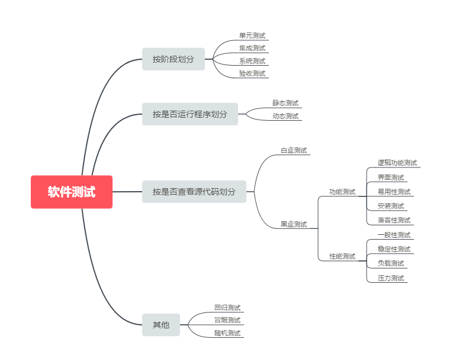
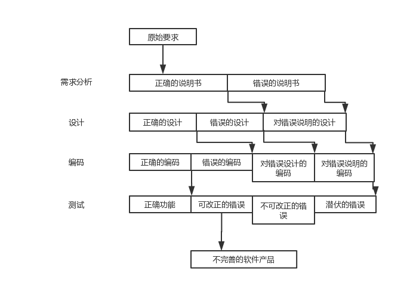
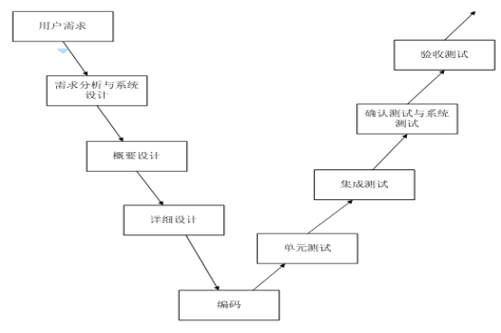
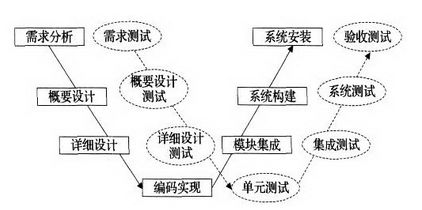
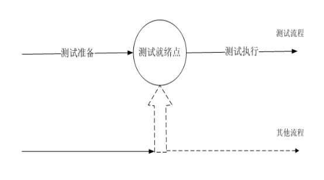
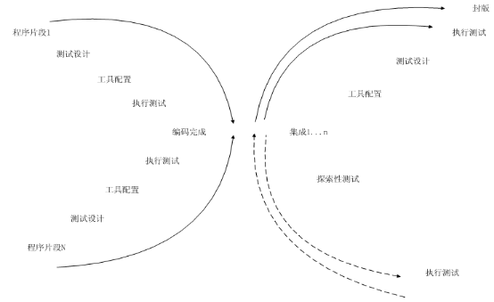

软件测试基本概念
----
 - 软件 = 程序+文档，软件测试 = 程序测试+文档测试 
 **程序**是指能够实现某种功能的指令集合，**文档**是指软件开发、使用和维护过程中产生的图文集合。
 
 - 软件的分类 
 按**功能**分：系统软件，应用软件。 
 按**技术架构**分：单机版软件，C/S结构软件（C指客户端，S指服务器端），B/S结构软件（B指浏览器） 
 按**用户**划分：产品软件，项目软件。 
 按**开发规模**划分：小型，中型，大型。 
 
 - BUG的定义 
 软件的BUG指的是软件中（包括程序和文档）*不符合用户需求*的问题。 
 常见的BUG分三种类型：**完全**没有实现功能；**基本实现**了用户需求的功能；实现了用户**不需要的**功能。 
 
 - 软件测试的环境 = 软件+网络+硬件+数据准备+测试工具。 
 **软件测试的环境要与软件生产运行环境保持一致，要从开发环境独立出来。**
 - 搭建环境：**真实、干净、无毒、独立。**
 
 - 软件环境的分类 
 1.软件开发环境:软件在开发过程中使用的环境。 
 2.软件生产运行环境:最终用户使用的环境。
 
 
 - 测试用例：指在测试执行之前设计的一套详细的测试方案，包括测试环境、测试步骤、测试数据与其结果。 
 **测试用例=输入+输出+测试环境**（输入包括测试数据和操作步骤，输出指的是期望结果，测试环境指的是系统环境设置）。 测试用例有两个模板：word和excel，前者适合性能测试，后者适合功能测试。
 ### 软件测试分类
   - **黑盒测试**：指的是把被测试的软件看做是一个黑盒子，我们不关心里面的结构是什么样的，只关心软件输入数据和输出结果。 
     黑盒测试技术：等价类划分、边界值、因果图、流程图。 
     **白盒测试**：指的是把盒子盖打开，去研究里面的源代码和程序结构。
     
   - **静态测试**：是指不实际运行被测软件，而只是静态的检查程序代码、界面或文档中可能存在的错误的过程。 
     **动态测试**：是指实际运行被测程序，输入相应的测试数据，检查实际输出结果和预期结果是否相符的过程。 
     我们判断一个测试属于动态测试还是静态测试的唯一标准就是看是否运行程序。 
   > ***注意***：同一个测试既有可能属于黑盒测试，也有可能属于动态测试；既有可能属于静态测试，也有可能属于白盒测试。它们之间也有可能交叉。
   - **按过程分类**
     1. **单元测试**：指的是对软件中最小可测试单元进行检查和验证。 
   
     2. **集成测试**：是单元测试的下一个阶段，是指将通过测试的单元模块组成系统或子系统，再进行测试，重点测试不同模块的接口部分。 
   
     3. **系统测试**：指的是将整个软件系统看作1个整体进行测试，包括功能、性能，以及软件所有运行的硬件环境进行测试。
     
     4. **验收测试**：指的是在系统测试的后期，以用户测试为主，或有测试人员等质量保障人员共同参与的测试它也是软件正式交付给用户使用的最后一道工序。 
     验收测试又分为α测试和β测试，α测试指的是由用户、测试人员、开发人员等共同参与的内部测试；β测试指的是内测后的公测，即完全交给最终的用户测试。
     
   - **功能测试**：是黑盒测试的一方面，它检测实际软件的功能是否符合用户的需求。功能测试又能细分为很多种：逻辑功能测试、界面测试、易用性测试、安装测试、兼容性测试等。
   
   - **性能测试**：软件的性能包括很多方面，主要有时间性能和空间性能两种。 
     1. 时间性能：主要指软件的一个具体事务的响应时间。
     2. 空间性能：主要指软件运行时所消耗的系统资源。 
     
     软件性能测试一般分为一般性能测试、稳定性能测试、负载测试和压力测试。 
     
     1. **一般性能测试**：让系统在正常的软硬件环境下运行，不向其施加任何压力的性能测试。 
     
     2. **稳定性能测试**（又称可靠性测试）：连续运行内测系统，检查系统运行的时间稳定程度。通常用MTBF（错误发生的平均时间间隔）来衡量系统的稳定性，越大稳定性越强。 
     
     3. **负载测试**：让被测系统在其能忍受的极限范围之内连续运行，来测试系统的稳定性。 
     
     4. **压力测试**：连续不断的给被测系统增加压力，直到被测系统压垮为止，用来测试系统所能承受的最大压力。 
     关于性能测试，可以用一个通俗的例子来理解：
     
     假设一个人很轻松就能背一袋米，背两袋米很吃力，最多就能背三袋米，那么 
     
           一般性能测试————我就让他背一袋米。
          
           稳定性测试—————我让他背一袋米，让他去操场上跑圈，看多久累倒。
          
           负载测试————让他背两袋米去操场去跑圈，看多久累倒。
          
           压力测试————让他背两袋米，三袋米，四袋米·····发现他最多只能背三袋米。
          
   - **回归测试**：是指对软件的新的版本测试时，重复执行上一个版本测试时的用例
   - **冒烟测试**：指对一个新版本进行系统大规模的测试之前，先验证一下软件的基本功能是否可以实现，是否具备可测性。
   - **随机测试**（又称猴子测试）：指测试中所有的输入数据都是随机生产的，其**目的**是模拟用户的真实操作，并发现边缘错误。 
     随机测试的缺点：测试不系统，无法统计代码覆盖率和需求覆盖率，很难回归测试等。
   - 不同测试分类之间的关系 
   
   
   - 什么是SQA？ 
     SQA(Software Quality Assurance,软件质量保障)的完整定义为：为确保软件开发过程和结果符合预期要求而建立的一系列规程，以及依照规程和计划采取的一系列活动及其结果评价。
     
   - 软件测试的一些基本原则
        - zero bug 和 good enough 
             zero bug指的是软件没有任何的bug，good enough指的是只要软件达到一定的质量要求，就可以停止测试了。 
             good enough原则是一种权衡投入/产出比的原则：不充分的测试是不负责任的；过分的测试是一种资源的浪费，同样也是不负责任的表现。
             
        - 不要试图穷举测试 
            穷举测试指的是测试时，考虑所有的可能的输入值。这是不切实际的，我们不可能把所有的输入值都考虑到并且这很花费时间和资源。我们需要使用最少的测试用例，来达到最大的覆盖率。
        
        - 软件测试要尽早执行 
            在需求分析阶段，引入的缺陷是最多的，修复成本是最少低的。所以要尽早开始软件测试，越到后面，修复成本越高。
            
        - 软件测试应该追溯需求 
            软件缺陷产生的原因（如图）
            
            
        - 缺陷的**二八原则** 
            二八原则指的是一般情况下，软件80%的缺陷集中在20%的模块中。所以我们测试时，在这20%的模块上，要投入较多的人力和精力重点测试。
        - 缺陷具有免疫力 
            如同害虫会对农药产生抗药性一样，缺陷也会产生"抗药性"。用旧版本的测试用例去测新版本的软件时，效果会大大的折扣。这就要求我们需要根据新版本的特点去修改和维护测试用。 
           > **注意**：每修复三到四个缺陷，一般就会产生一个新的缺陷。
            
            
   - 软件测试模型
        - 瀑布模型 
            
        - V模型 
         
        - W模型 
         
        - H模型 
         
        - x模型   
         
        
   - 黑盒测试技术
        - **等价类划分** 
           等价类划分可分为有效等价类和无效等价类。 
            > 有效等价类：指符合《需求规格说明书》，合理地输入数据集合。 
            无效等价类：指不符合《需求规格说明书》，无意义地输入数据集合。
            
            - 等价类栗子：
            
                假设登录用户名只能是字母和数字，这时字母和数字就是有效等价类，非字母和数字都是无效等价类。
            
        - **边界值划分** 
            边界值指输入和输出等价类中那些恰好处于边界、或者超过边界、或者在边界一下的状态的值。
            > 边界值分析和等价类划分方法存在两方面不同： 
                1. 与从等价类中挑选出任意一个元素作为代表不同，边界值分析需要选择一个或多个元素，以便等价类的每个边界都经过一次测试。 
                2. 与仅仅关注输入条件（输入空间）不同，还需要考虑从结果空间（输出等价类）设计测试用例。
             - 边界值栗子： 
                假设输入域输入值范围为1~10，那么0、11就是离点，1、10就是上点，2,9就是内点。
             
        - **决策表** 
           决策表也被成为判定表，适合描述在不同逻辑条件下取值组合的情况下需要执行的动作。
           >决策表由四个部分组成： 
           决策桩：列出问题中可能出现的条件。 
           动作桩：列出解决问题可能采取的操作。 
           条件项：针对所有条件的取值列出不同条件取值的组合。 
           动作项：在条件项各种取值的情况下应该采取的动作。
        - **因果图法** 
           因指的是输入；果指的是输出。因果图法比较适合输入条件比较多的情况。 
           因果图有助于用一个系统的方法选择出高效的测试用例集。它还有一个额外的好处，就是可以指出规格说明的不完整性和不明确性。
           - 因果图栗子：
             pass
             
        - **流程图法** 
           算法流程图是针对程序内部结构的，而黑盒测试的流程图是针对整个系统业务功能流程的。 
           流程图法一般不是针对某个页面或是某个模块的测试，而是将被测系统看作一个完整的系统，从宏观上来分析其业务流程，然后再画出流程图。
           - 流程图栗子：
           pass
         
        - **场景法** 
            根据实际情况，对程序的功能或业务进行描述，模拟特定情况下，可能发生的事件，观察事件的最终结果。
   - 代码检查、走查与审评（本内容摘抄于《软件测试的艺术》）
        - 代码检查与走查 
        代码检查、走查以及可用性测试是三种主要的人工测试方法。 
        所谓**代码检查**，是以组为单位阅读代码，它是一系列规程和错误检查技术的集合。 
        **代码走查**与代码检查很相似，但是规程稍微有所不同，采用的错误检查技术也不一样。 
        代码检查、走查都要求人们组成一个小组来阅读或直观检查特定的程序。 
        代码走查的优点：一旦发现错误，通常就能在代码中对其进行精确定位，降低了调试（错误修正）的成本。这个过程通常发现成批的错误，这样的错误就可以一同得到修正。
        > 代码检查的衍生功效：其一，程序员通常会得到编程风格、算法选择及编程技术等方面的反馈信息。
        其二，其他参与者也可以通过接触程序员的错误和编程风格而同样受益匪浅。
        其三，能够在早期发现程序中脆弱部分的方法之一，有助于在测试过程中将更多的注意力集中在这些脆弱的地方。
            
        - 用于代码检查的错误列表
          1. 数据引用错误
          2. 数据声明错误
          3. 运算错误
          4. 比较错误
          5. 流程控制错误
          6. 控制流错误
          7. 接口错误
          8. 输入/输出错误
          9. 其他错误
   - 白盒测试方法
     - 语句覆盖：
        设计若干个测试用例，使得被测程序的每一条可执行语句至少被执行一次。
     
     - 判定覆盖（分支覆盖）：
        设计若干个测试用例，使得被测程序的每个判定语句至少有一次为真值，有一次为假值。
        
     - 条件覆盖：
        设计若干个测试用例，使得被测程序的每个判定语句中的每个条件的可能结果至少执行一次。
        
     - 判定/条件覆盖：
        设计若干个测试用例，使得被测程序的每个判定语句中每个条件的所有可能结果至少出现一次，每个判定本身所有可能结果也至少出现一次。
        
     - 条件组合覆盖：
        设计若干个测试用例，使得被测程序的每个判定语句中的每个条件的可能结果的所有组合至少执行一次。
        
     - 路径覆盖：
        设计若干个测试用例，使得被测程序中的所有路径执行一次。
        
### 软件失效分类

  软件失效机制可以描述为：软件错误->软件缺陷->软件故障->软件失效
  
  - 软件错误是指在软件生存期内的不希望或不可接受的人为错误，其结果是导致软件缺陷的产生。可
见，软件错误是一种人为过程，相对于软件本身，是一种外部行为。
  - 软件缺陷存在于软件（文档、数据、程序）之中的那些不希望或不可接受的偏差。其结果是软件运
行于某一特定条件时出现软件故障，这时称软件缺陷阶段。
  - 软件故障是指软件运行过程中出现的一种不希望或不可接受的内部状态。
  - 软件失效是指软件运行时产生的一种不希望或不可接受的外部行为结果。

错误的定义是：不正确的事务和行为。错误是在系统运行时，引起或可能潜在地引起失效的缺陷，是一种面向开发概念。

软件缺陷：
   - 软件未达到产品说明书中标明的功能；
   - 软件出现了产品说明书中指明的不会出现的错误；
   - 软件功能超出了产品说明书指明的范围；
   - 软件未达到产品说明书虽未指出应达到的目标；
   - 软件测试人员认为软件难以理解、不易使用、运行速度慢，或最终用户认为不好使用。

产品说明书是软件缺陷的第一来源，也就出自于软件需求说明书本身的问题。

设计方案（软件设计说明书）是软件缺陷第二来源。

#### 缺陷与错误严重性和优先级

软件缺陷和错误会带来软件失效的风险，重要软件故障与失效会导致重大的经济损失与灾难。给软件缺陷与错误划分严重性和优先级的通用原则是：
 - 表示软件缺陷所造成的危害的恶劣程度；
 - 优先级表示修复缺陷的重要程度和次序；

严重级：
- 严重：系统崩溃、数据丢失、数据毁坏
- 较严重：操作性错误、错误结果、遗漏功能
- 一般：小问题、错别字、UI 布局、罕见故障
- 建议：不影响使用的瑕疵或更好的实现

优先级：
- 最高优先级：立即修复，停止进一步测试
- 次高优先级：在产品发布之前必须修复
- 中等优先级：如果时间允许应该修复
- 最低等优先级：可能会修复，但是也能发布

        
        